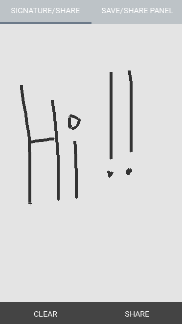

## Fuse Share Draw/Signature example

This app contains:
- A example to draw something and share it.
- A example to share any Panel or section of the app.

To work you need to use this PR of the fuselibs (https://github.com/fuse-open/fuselibs/pull/1253). 
For more information visit https://medium.com/@andrewq/hello-world-eaa996c594b7

Remember to change the path of .unoconfig to your fuselibs/Source folder 

(https://fuseopen.com/)